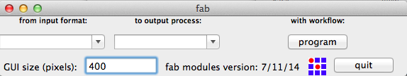

fabmoduleでModela MDX-15を動かす手順メモ
==============================

環境
----
 * OS: Mac OSX Version 10.9.3
 * USBtoRS232ケーブル: [StarTechUSB to RS232 DB9 Serial Adapter Cable M/M (ICUSB232)](http://www.amazon.com/StarTech-RS232-Serial-Adapter-Cable/dp/B000067SNB/ref=sr_1_16?s=electronics&ie=UTF8&qid=1401599135&sr=1-16&keywords=star+tech+serial)

fabmoduleのインストール
-----------------------
1. [Fab Moduleサイト(mit.edu)](http://kokompe.cba.mit.edu/downloads.html)で手順を確認する
2. XCode をAppStoreからインストールする[(参考)](https://itunes.apple.com/jp/app/xcode/id497799835?mt=12)
3. Command Line Tools for XCode をインストールする[(参考)](http://qiita.com/3yatsu/items/47470091277d46f3fde2)
4. Homebrewをインストールする[(参考)](http://qiita.com/b4b4r07/items/6efebc2f3d1cbbd393fc)
5. Applications -> Utilities -> Terminal をクリックしターミナルを起動する
6. `$brew install boost cmake libpng giflib`　とタイプしfabmoduleの作成に必要なライブラリをインストールする
7. wxPythonをインストールする  
 7.1. http://www.wxpython.org/download.php にアクセスする  
 7.2. wxPython3.0-osx-cocoa-py2.7 をクリックする  
 7.3. wxPython3.0-osx-3.0.0.0-cocoa-py2.7.dmgをクリックする  
 7.4. wxPython3.0-osx-cocoa-py2.7.pkgをクリックする  
 7.5. インストーラの指示通りにインストールする  
8. fabmoduleをインストールする    
 8.1. http://kokompe.cba.mit.edu/downloads.html にアクセスする  
 8.2. downloadリンクをクリックしfabmoduleのソースコードをダウンロードする  
 8.3. ダウンロードしたfab_srcフォルダをホームディレクトリ(/Users/&lt;your home dir&gt;/)に移動する  
 8.4. Applications -> Utilities -> Terminal をクリックする  
 8.5. `$cd fab_src` とタイプしfab_srcフォルダに移動する  
 8.6. `$make fab` とタイプしfabmoduleを作成する  
 8.7. `$make install`　とタイプしfabmoduleをインストールする  
9. `$fab` とタイプし、ウインドウが表示されアプリが起動することを確認する

    ||
    |:-------------------------------------------:|
    |図１.　正しくインストールできたらfabmoduleがこのように表示される|

    Note: Step2,3,4でインストールするソフトウエアは既に私のマシンにインストール済みでしたので参考のみ記載

Modela接続準備
--------------
1. USBtoSerialドライバをインストールする  
 1.1. http://www.startech.com/Downloads を開く  
 1.2. EnterProductIDに ICUSB232V2 とタイプしSerchボタンをクリックする  
 1.3. 表示される[サイト](http://www.startech.com/Cards-Adapters/Serial-Cards-Adapters/USB-to-RS232-Serial-Adapter-Cable~ICUSB232V2#dnlds)を確認する  
 1.4. Prolific_PL2303.zip をクリックしダウンロードする  
 1.5. Prolific_PL2303/Mac/Mac OS 10.6_10.7/PL2303_1.4.0.dmg をクリックする  
 1.6. PL2303_1.4.0をクリックしインストーラの指示通りにインストールする  
 1.7. macを再起動する  
 1.8. Modela MDX-15とmacをUSBtoSerialで接続する  
 1.9. Applications -> Utilities -> Terminal をクリックする  
 1.10. `$ls /dev/tty.usb*` とタイプし　/dev/tty.usbserialと表示されることを確認する(MODELA付属のケーブルを利用した場合は/dev/tty.usbserial-A600FRTW と表示されることを確認する)  
2. pySerialをインストールする  
 2.1. `$sudo easy_install pip` とタイプしpythonのパッケージ管理システムをインストールする  
 2.2. `$sudo pip install pyserial` とタイプしpythonのserialパッケージをインストールする  
3. fabmoduleを修正する  
3.1. `$cp -p /usr/local/bin/rml_send_gui /usr/local/rml_send_gui.orig` とタイプし、修正前のファイルを別名で保存する  
3.2. `$sed -i -e 's/ttyUSB0/tty.usbserial/' /usr/local/bin/rml_send_gui` とタイプし/usr/local/bin/rml_send_guiというテキストファイルの中の*ttyUSB0*と記載されている箇所をすべて*tty.usbserial*に変更する(MODELA付属のケーブルを利用する場合は*ttyUSB0*を*tty.usbserial-A600FRTW*に変更する)  
3.3. `$cp -p /usr/local/bin/fab_send /usr/local/bin/fab_send.orig` とタイプし、修正前のファイルを別名で保存する  
3.4. `$sed -i -e 's/ttyUSB0/tty.usbserial/' /usr/local/bin/fab_send` とタイプし/usr/local/bin/fab_sendというテキストファイルの中の*ttyUSB0*と記載されている箇所を*tty.usbserial*に変更する(MODELA付属のケーブルを利用する場合は*ttyUSB0*を*tty.usbserial-A600FRTW*に変更する)    
 
fabmoduleでModelaMDX-15を動かす
-------------------------------
1. ターミナルで`$fab`とタイプしfabmoduleを起動する
2. fabmoduleの使い方は[こちらのサイト(qiita.com)](http://qiita.com/mio_k/items/231fec28b5491345e469)が参考になりました
 
